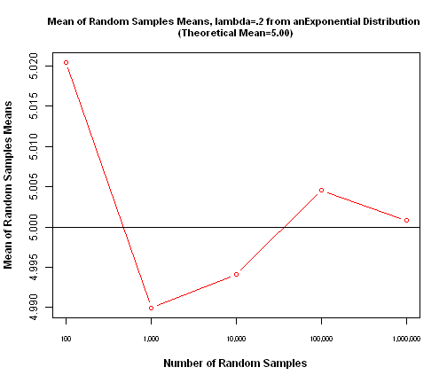
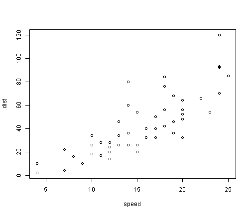
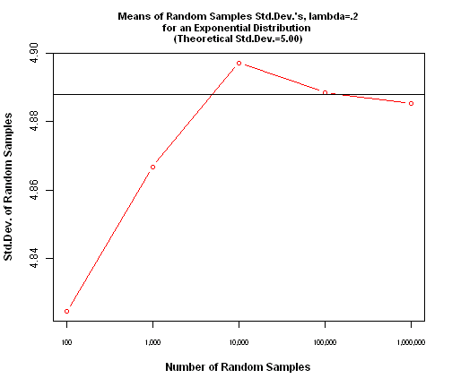
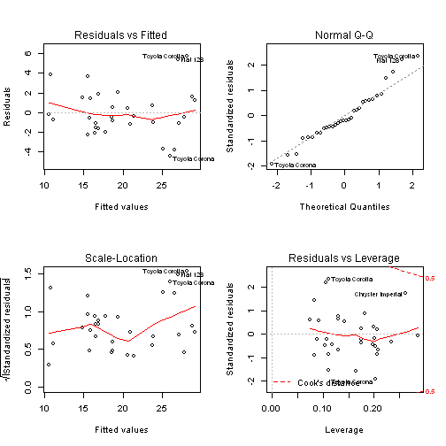
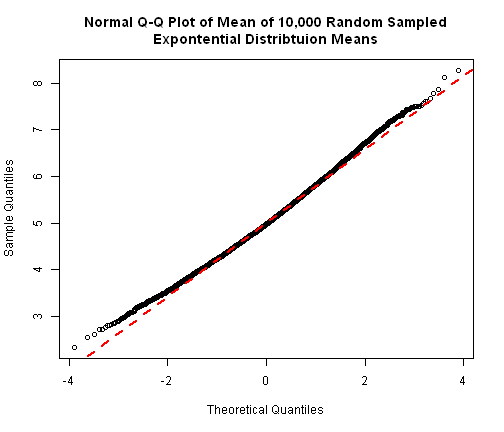
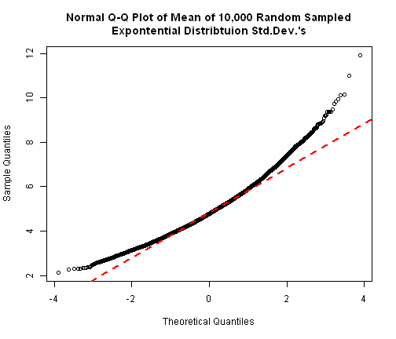

Reproducible Research-Peer Assessment 1
========================================================

Loading and Preprocessing the data:

```r
###############################################################Peer Review 1
##############################################Open file: activity.csv and load into dataframe activity.df with correct formats
activity.df<-read.csv("activity.csv", colClasses = c("numeric", "Date", "numeric"))
```

What is mean total number of steps taken per day? 

```r
##############################################What is the total number of steps per day?
##############Calculate total daily steps taken and daily mean and median.
(total.steps<-aggregate(activity.df$steps, by=list(activity.df$date), FUN=sum, na.rm = TRUE))
```

```
##       Group.1     x
## 1  2012-10-01     0
## 2  2012-10-02   126
## 3  2012-10-03 11352
## 4  2012-10-04 12116
## 5  2012-10-05 13294
## 6  2012-10-06 15420
## 7  2012-10-07 11015
## 8  2012-10-08     0
## 9  2012-10-09 12811
## 10 2012-10-10  9900
## 11 2012-10-11 10304
## 12 2012-10-12 17382
## 13 2012-10-13 12426
## 14 2012-10-14 15098
## 15 2012-10-15 10139
## 16 2012-10-16 15084
## 17 2012-10-17 13452
## 18 2012-10-18 10056
## 19 2012-10-19 11829
## 20 2012-10-20 10395
## 21 2012-10-21  8821
## 22 2012-10-22 13460
## 23 2012-10-23  8918
## 24 2012-10-24  8355
## 25 2012-10-25  2492
## 26 2012-10-26  6778
## 27 2012-10-27 10119
## 28 2012-10-28 11458
## 29 2012-10-29  5018
## 30 2012-10-30  9819
## 31 2012-10-31 15414
## 32 2012-11-01     0
## 33 2012-11-02 10600
## 34 2012-11-03 10571
## 35 2012-11-04     0
## 36 2012-11-05 10439
## 37 2012-11-06  8334
## 38 2012-11-07 12883
## 39 2012-11-08  3219
## 40 2012-11-09     0
## 41 2012-11-10     0
## 42 2012-11-11 12608
## 43 2012-11-12 10765
## 44 2012-11-13  7336
## 45 2012-11-14     0
## 46 2012-11-15    41
## 47 2012-11-16  5441
## 48 2012-11-17 14339
## 49 2012-11-18 15110
## 50 2012-11-19  8841
## 51 2012-11-20  4472
## 52 2012-11-21 12787
## 53 2012-11-22 20427
## 54 2012-11-23 21194
## 55 2012-11-24 14478
## 56 2012-11-25 11834
## 57 2012-11-26 11162
## 58 2012-11-27 13646
## 59 2012-11-28 10183
## 60 2012-11-29  7047
## 61 2012-11-30     0
```

```r
hist(total.steps$x,breaks=30,col="seagreen", xlab="Total Daily Steps Taken", main="Personal Activity Monitoring \nDaily Steps Taken October 2012 -Novemeber 2012", ylab="Frequency", xlim = c(0, 25000), font.lab=2)
```

 

```r
daily.mean<-mean(total.steps$x, na.rm = TRUE)
daily.median<-median(total.steps$x, na.rm = TRUE)
```


What is the average daily activity patter?

```r
##############################################What is the average daily activity pattern?
##############Make a time series plot (i.e. type = "l") of the 5-minute interval (x-axis) and the average number of steps taken, averaged across all days (y-axis)
interval.steps <-as.ts(aggregate(activity.df$steps, by=list(activity.df$interval), FUN=mean, na.rm = TRUE))
colnames(interval.steps) <- c("Interval", "Steps")
plot(interval.steps[,1], interval.steps[,2], type ="l", xlab="5 Minute Interval", ylab="Interval Average Number of Steps Taken", main="Average 5-Minute Interval Daily Step Count \nOctober 2012-Novemeber 2012", xlim=c(0,2400), col="blue")
```

 

```r
##############find max value and plot the results.
max.vals<-interval.steps[which.max(interval.steps[,2]),]
```


Imputing missing values (replacment with column means)

```r
##############################################Imputing missing values-NA's-1

##############Calculate and report the total number of missing values in the dataset 
(total.na<-sum(is.na(activity.df[,1])))
```

```
## [1] 2304
```

```r
##############Imputing missing values (NA) with column means
activity1.df<-read.csv("activity.csv", colClasses = c("numeric", "Date", "numeric"))
activity1.df[,1][is.na(activity1.df[,1])] <- mean(activity1.df$steps, na.rm = TRUE)

################################Calculate total daily steps taken and daily mean and median-0 replacing NA
(total.steps1<-aggregate(activity1.df$steps, by=list(activity1.df$date), FUN=sum, na.rm = TRUE))
```

```
##       Group.1     x
## 1  2012-10-01 10766
## 2  2012-10-02   126
## 3  2012-10-03 11352
## 4  2012-10-04 12116
## 5  2012-10-05 13294
## 6  2012-10-06 15420
## 7  2012-10-07 11015
## 8  2012-10-08 10766
## 9  2012-10-09 12811
## 10 2012-10-10  9900
## 11 2012-10-11 10304
## 12 2012-10-12 17382
## 13 2012-10-13 12426
## 14 2012-10-14 15098
## 15 2012-10-15 10139
## 16 2012-10-16 15084
## 17 2012-10-17 13452
## 18 2012-10-18 10056
## 19 2012-10-19 11829
## 20 2012-10-20 10395
## 21 2012-10-21  8821
## 22 2012-10-22 13460
## 23 2012-10-23  8918
## 24 2012-10-24  8355
## 25 2012-10-25  2492
## 26 2012-10-26  6778
## 27 2012-10-27 10119
## 28 2012-10-28 11458
## 29 2012-10-29  5018
## 30 2012-10-30  9819
## 31 2012-10-31 15414
## 32 2012-11-01 10766
## 33 2012-11-02 10600
## 34 2012-11-03 10571
## 35 2012-11-04 10766
## 36 2012-11-05 10439
## 37 2012-11-06  8334
## 38 2012-11-07 12883
## 39 2012-11-08  3219
## 40 2012-11-09 10766
## 41 2012-11-10 10766
## 42 2012-11-11 12608
## 43 2012-11-12 10765
## 44 2012-11-13  7336
## 45 2012-11-14 10766
## 46 2012-11-15    41
## 47 2012-11-16  5441
## 48 2012-11-17 14339
## 49 2012-11-18 15110
## 50 2012-11-19  8841
## 51 2012-11-20  4472
## 52 2012-11-21 12787
## 53 2012-11-22 20427
## 54 2012-11-23 21194
## 55 2012-11-24 14478
## 56 2012-11-25 11834
## 57 2012-11-26 11162
## 58 2012-11-27 13646
## 59 2012-11-28 10183
## 60 2012-11-29  7047
## 61 2012-11-30 10766
```

```r
hist(total.steps1$x,breaks=30,col="seagreen", xlab="Total Daily Steps Taken", main="NA's replaced by Column Average\nDaily Steps Taken October 2012 -Novemeber 2012", ylab="Frequency", xlim = c(0, 25000), font.lab=2)
```

 

```r
(daily.mean1<-mean(total.steps1$x))
```

```
## [1] 10766
```

```r
(daily.median1<-median(total.steps1$x))
```

```
## [1] 10766
```

```r
################################Calculate and report the total number of missing values in the dataset 
(total.na1<-sum(is.na(activity1.df[,1])))
```

```
## [1] 0
```

Imputing missing values (replacment with interval means)

```r
##############################################Imputing missing values-NA's-2 (Interval means)
#########replace with Interval Means
activity2.df<-read.csv("activity.csv", colClasses = c("numeric", "Date", "numeric"))
###Imputing missing values (NA) with column means
for (i in 1:nrow(activity2.df)) {activity2.df[i,1]<-ifelse(is.na(activity2.df[i,1]), interval.steps[interval.steps[,1]==activity2.df[i,3],2], activity2.df[i,1])}
################################Calculate total daily steps taken and daily mean and median-0 replacing NA with Interval Means
(total.steps2<-aggregate(activity2.df$steps, by=list(activity.df$date), FUN=sum, na.rm = TRUE))
```

```
##       Group.1     x
## 1  2012-10-01 10766
## 2  2012-10-02   126
## 3  2012-10-03 11352
## 4  2012-10-04 12116
## 5  2012-10-05 13294
## 6  2012-10-06 15420
## 7  2012-10-07 11015
## 8  2012-10-08 10766
## 9  2012-10-09 12811
## 10 2012-10-10  9900
## 11 2012-10-11 10304
## 12 2012-10-12 17382
## 13 2012-10-13 12426
## 14 2012-10-14 15098
## 15 2012-10-15 10139
## 16 2012-10-16 15084
## 17 2012-10-17 13452
## 18 2012-10-18 10056
## 19 2012-10-19 11829
## 20 2012-10-20 10395
## 21 2012-10-21  8821
## 22 2012-10-22 13460
## 23 2012-10-23  8918
## 24 2012-10-24  8355
## 25 2012-10-25  2492
## 26 2012-10-26  6778
## 27 2012-10-27 10119
## 28 2012-10-28 11458
## 29 2012-10-29  5018
## 30 2012-10-30  9819
## 31 2012-10-31 15414
## 32 2012-11-01 10766
## 33 2012-11-02 10600
## 34 2012-11-03 10571
## 35 2012-11-04 10766
## 36 2012-11-05 10439
## 37 2012-11-06  8334
## 38 2012-11-07 12883
## 39 2012-11-08  3219
## 40 2012-11-09 10766
## 41 2012-11-10 10766
## 42 2012-11-11 12608
## 43 2012-11-12 10765
## 44 2012-11-13  7336
## 45 2012-11-14 10766
## 46 2012-11-15    41
## 47 2012-11-16  5441
## 48 2012-11-17 14339
## 49 2012-11-18 15110
## 50 2012-11-19  8841
## 51 2012-11-20  4472
## 52 2012-11-21 12787
## 53 2012-11-22 20427
## 54 2012-11-23 21194
## 55 2012-11-24 14478
## 56 2012-11-25 11834
## 57 2012-11-26 11162
## 58 2012-11-27 13646
## 59 2012-11-28 10183
## 60 2012-11-29  7047
## 61 2012-11-30 10766
```

```r
hist(total.steps2$x,breaks=30,col="seagreen", xlab="Total Daily Steps Taken", main="NA's replaced by Interval Means\nDaily Steps Taken October 2012 -Novemeber 2012", ylab="Frequency", xlim = c(0, 25000), font.lab=2)
```

 

```r
(daily.mean2<-mean(total.steps2$x))
```

```
## [1] 10766
```

```r
(daily.median2<-median(total.steps2$x))
```

```
## [1] 10766
```

```r
(total.na2<-sum(is.na(activity2.df[,1])))
```

```
## [1] 0
```

Are there differences in activity patters between weekdays and weekend?

```r
##############################################Are there differences between weekdays and weekends?
activity3.df<-read.csv("activity.csv", colClasses = c("numeric", "Date", "numeric"))
activity3.df$date<-weekdays(activity3.df$date)
activity3.df$date<-ifelse(activity3.df$date==c("Saturday", "Sunday"), "Weekend", "Weekday")


####################aggegrate by date and interval
library(lattice)
```

```
## Warning: package 'lattice' was built under R version 3.0.3
```

```r
interval2.steps<-aggregate(steps~date+interval, data=activity3.df, sum, na.rm=TRUE)
Weekday<-subset(interval2.steps, date == "Weekday")
Weekend<-subset(interval2.steps, date == "Weekend")

par(mfrow = c(2, 1))
plot(Weekday[,2], Weekday[,3], type ="l", xlab="5 Minute Interval", ylab="Number of Steps Taken", main="5-Minute Interval Weekday Daily Step Count \nOctober 2012-Novemeber 2012", ylim=c(0,10000), xlim=c(0,2400), col="blue")

plot(Weekend[,2], Weekend[,3], type ="l", xlab="5 Minute Interval", ylab="Number of Steps Taken", main="5-Minute Interval Weekend Daily Step Count \nOctober 2012-Novemeber 2012", ylim=c(0,10000), xlim=c(0,2400), col="blue")
```

 

```r
par(mfrow = c(1, 1))


xyplot(interval2.steps[,3] ~ interval2.steps[,2] | interval2.steps[,1], type ="l", layout = c(1, 2)) ## Plot with 2 panels
```

 

